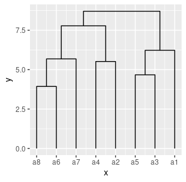
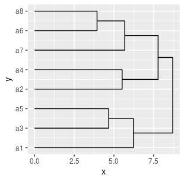
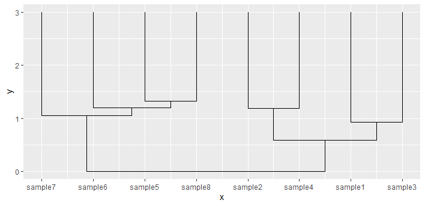
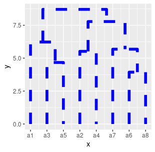
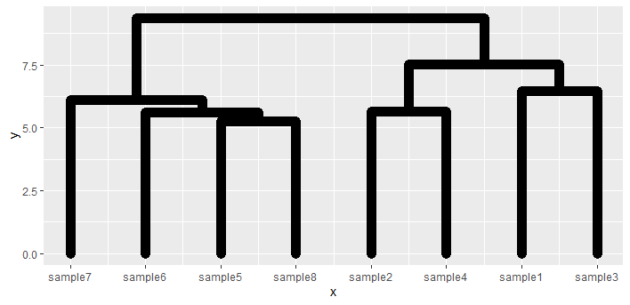

# ggdendroplot
An [R](https://www.r-project.org) package that draws highly modifiable dendrograms in [ggplot2](https://ggplot2.tidyverse.org/). The dendrogram can easily be modified and added to an existing ggplot object. ggdendroplot takes as an input the output of the R [stats](https://stat.ethz.ch/R-manual/R-devel/library/stats/html/stats-package.html) function hclust(). It vizualizes the clustering using ggplot2's geom_path layers.

# Installation
Install the ggdendroplot package from the git repository:
``` r
devtools::install_github("solatar/dendroplot")
```

# Default dendrogram
Load the package, create your first brace in ggplot. You can change the clustering algorithm via the clustmethod arguement ("complete" as default, check out ?hclust to see what other options there are for the method).
``` r
library(ggbrace)
library(ggplot2)

#a test data.frame
df <- matrix(rnorm(128), ncol = 8)
colnames(df) <- paste0("a",seq(ncol(df)))

#perform hierarchical clustering
distmatrix <- dist(t(df))
clust <- hclust(distmatrix)

ggplot() + geom_dendro(clust)
```


Change the order:
``` r
ggplot() + geom_dendro(clust, xlim=c(3,0))
```


Change the orientation:
``` r
ggplot() + geom_dendro(clust, pointing="side")
```


Change the placement by defining xlim and ylim. With this you can also invert the graph if the first number of xlim or ylim is higher than the second:
``` r
ggplot() + geom_dendro(clust, ylim=c(3,0))
```


# Custom dendrogram
You can change the dendrogram in the same way that you would also change a geom_path object. Specifically you can change color, size, linetype and lineend. 
Possible options for linetype are: solid (default), dotted, dotdash, twodash, dashed, longdash, blank.
``` r
ggplot() + geom_dendro(clust, size=2, color="blue", linetype="dashed")
```


The lineend arguement introduces suttle changes, effecting only how the ends of the lines look.
Possible options are: butt (default), square, round.
``` r
ggplot() + geom_dendro(clust, size=4, lineend="round")
```

