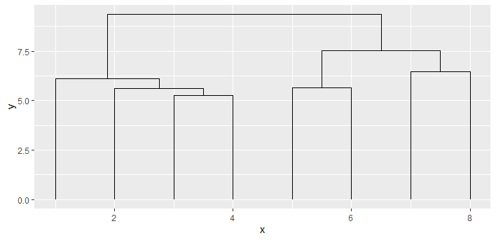
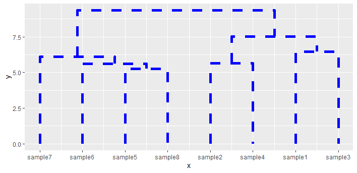

# ggdendroplot
An [R](https://www.r-project.org) package that draws highly modifiable dendrograms in [ggplot2](https://ggplot2.tidyverse.org/). The dendrogram can easily be modified and added to an existing ggplot object. ggdendroplot takes as an input the output of the R [stats](https://stat.ethz.ch/R-manual/R-devel/library/stats/html/stats-package.html) function hclust(). It vizualizes the clustering using ggplot2's geom_path layers.

# Installation
Install the ggdendroplot package from the git repository:
``` r
devtools::install_github("solatar/ggdendroplot")
```

# Default dendrogram
Load the package, create your first brace in ggplot. You can change the clustering algorithm via the clustmethod arguement ("complete" as default, check out ?hclust to see what other options there are for the method).
``` r
library(ggdendroplot)
library(ggplot2)

#a test data.frame, with columns drawing values from 2 different standard distributions
df <- matrix(c(rnorm(64, mean=0), rnorm(64, mean=1)), ncol = 8, dimnames=list(
  rownames=paste0("trait",seq(16)),
  colnames=paste0("sample",seq(8))
))

#perform hierarchical clustering
rowclus <- hclust(dist( df ))    #cluster the rows
colclus <- hclust(dist( t(df) )) #cluster the columns

ggplot() + geom_dendro(colclus)
```


Often, we dont't just want a dendrogram, but also a heatmap. ggdendroplot provides the function hmReady, which takes the original table and the clustering you made. It uses [reshape2](https://cran.r-project.org/web/packages/reshape2/index.html) to output a ready-to-plot data.frame. This data.frame has columns x and y for coordinates, and a value column for the color in the heatmap. It also has the columns rowid and variable, which contain the row and column names of the original table.

Here we use the data.frame for geom_tile and additionally set the x axis to display its labels in a 45 degree angle. The original column labels will be added later, when we add the heatmap.

``` r
hm <- hmReady(df, colclus=colclus)

hmplot <- ggplot() + 
  geom_tile(data=hm, aes(x=x, y=y, fill=value)) +
  theme(axis.text.x=element_text(angle=45, hjust=1))

print(hmplot)
```


When we simply add the dendrogram to the plot, we see that it is not in the correct place. We can move it up by specifying the ylim arguement.
``` r
hmplot + geom_dendro(colclus)
hmplot + geom_dendro(colclus, ylim=c(17,20))
```


# Custom dendrogram

Change the order. This happens when you set the limits so that the first limit number (here: 3) is higher than the second (here: 0). Note that now, the dendrogram will not line up with your heatmap and will give you a false impression, which is why this reversal is only possible when you set the failsafe arguement to FALSE.
``` r
ggplot() + geom_dendro(colclus, xlim=c(3,0), failsafe=FALSE)
```


Change the placement by defining xlim and ylim. With this you can also invert the graph if the first number of xlim or ylim is higher than the second:
``` r
ggplot() + geom_dendro(colclus, ylim=c(3,0))
```


You can disable that geom_dendro displays the sample names:
``` r
ggplot() + geom_dendro(colclus, axis.labels = F)
```


You can change the dendrogram in the same way that you would also change a geom_path object. Specifically you can change color, size, linetype and lineend. 
Possible options for linetype are: solid (default), dotted, dotdash, twodash, dashed, longdash, blank.
``` r
ggplot() + geom_dendro(colclus, size=2, color="blue", linetype="dashed")
```


The lineend arguement introduces suttle changes, effecting only how the ends of the lines look.
Possible options are: butt (default), square, round.
``` r
ggplot() + geom_dendro(colclus, size=4, lineend="round")
```

