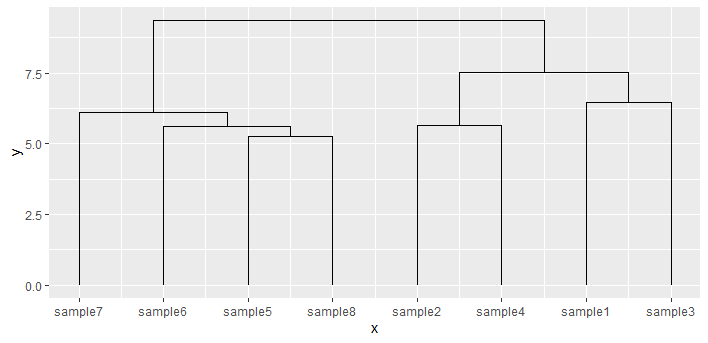

# ggdendroplot

Draws dendrograms for [ggplot2](https://ggplot2.tidyverse.org/) that can be modified by you as you want.

## Installation
Install the ggdendroplot package from the git repository:
``` r
devtools::install_github("solatar/dendroplot")
```

## Default braces
Load the package, create your first brace in ggplot:
``` r
library(ggbrace)
library(ggplot2)
df <- matrix(rnorm(128), ncol = 8)
colnames(df) <- paste0("a",seq(ncol(df)))

ggplot() + geom_dendro(df)
```

