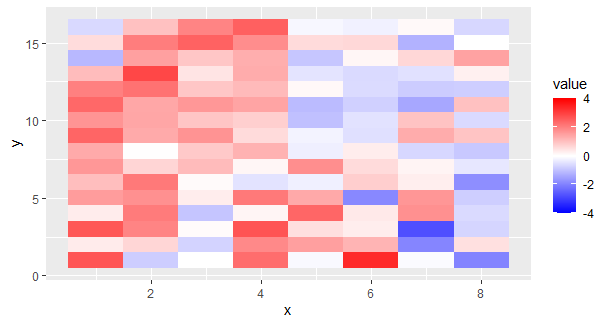
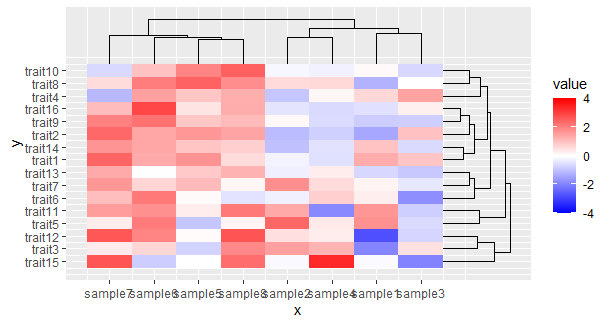
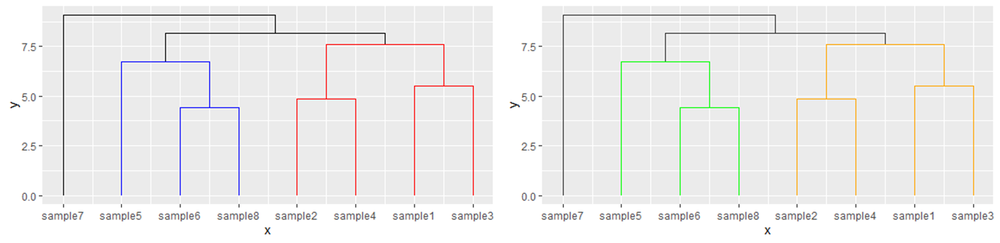

- [Default Dendrogram](#Default-Dendrogram)
- [Heatmaps](#Heatmaps)
- [Distance Matrices](#Distance-Matrices)
- [Customization](#Customization)

# ggdendroplot
An [R](https://www.r-project.org) package that draws highly modifiable dendrograms in [ggplot2](https://ggplot2.tidyverse.org/). The dendrogram can easily be modified and added to an existing ggplot object. ggdendroplot takes as an input the output of the R [stats](https://stat.ethz.ch/R-manual/R-devel/library/stats/html/stats-package.html) function hclust(). It vizualizes the clustering using ggplot2's geom_path layers. If you prefer bayesian clustering, ggdendroplot also works with the output of the bclust function of the [bclust](https://bclust.r-forge.r-project.org/) package (download [here](https://github.com/cran/bclust)).

ggdendroplot functions:

- geom_dendro: plots a dendrogram
- theme_hm: sets ggplot options most likely desired when plotting dendrograms and heatmaps
- hmGradient: provides a typical heatmap red-to-blue color theme
- hmReady: takes a data.frame and prepares it for being plotted as a heatmap in ggplot's geom_tile
- list_to_frame: takes a list of character vectors and turns it into a data.frame. This can in turn be used by hmReady


# Installation
Install the package from the git repository:
``` r
devtools::install_github("nicolash2/ggdendroplot")
```

# Default Dendrogram
First we need  a matrix/data.frame that has column names if you want to cluster the columns, and rownames if you want to cluster the rows. If you start from a setlist (a list of charachter vectors), you can use the <b>list_to_frame</b> function, as long as each item in that list has a name. Here we build a random example matrix, called df. We use the functions dist and hclust from base R to get hclust objects. We cluster rows (rowclus) and columns (colclus) individually. You can change the distance matrix and also clustering algorithm by checking out the respective functions' help pages (?dist and ?hclust).
Then we can directly take one of these clusterings and vizualize a dendrogram from it.
``` r
library(ggdendroplot)
library(ggplot2)

# test data.frame, with columns drawing values from 2 different standard distributions
df <- matrix(c(rnorm(64, mean=0), rnorm(64, mean=1)), ncol = 8, dimnames=list(
  rownames=paste0("trait",seq(16)),
  colnames=paste0("sample",seq(8))
))

# perform hierarchical clustering
colclus <- hclust(dist( t(df) )) #cluster the columns

ggplot() + geom_dendro(colclus)
```


# Heatmaps

Often, we dont't just want a dendrogram, but also a heatmap. ggdendroplot provides the function hmReady, which takes the original table and the clustering you made. It uses [reshape2](https://cran.r-project.org/web/packages/reshape2/index.html) to output a ready-to-plot data.frame. This data.frame has columns x and y for coordinates, and a value column for the color in the heatmap. It also has the columns rowid and variable, which contain the row and column names of the original table. We can supply colclus or rowclus or both to get a dataframe that is clustered accordingly.

Here we only use the column clustering (colclus) as a simple example.

``` r
# test data.frame, with columns drawing values from 2 different standard distributions
df <- matrix(c(rnorm(64, mean=0), rnorm(64, mean=1)), ncol = 8, dimnames=list(
  rownames=paste0("trait",seq(16)),
  colnames=paste0("sample",seq(8))
))

# perform hierarchical clustering
rowclus <- hclust(dist( df ))    #cluster the rows
colclus <- hclust(dist( t(df) )) #cluster the columns

# bring the data.frame into a from easily usable by ggplot
hm <- hmReady(df, colclus=colclus, rowclus=rowclus)

# plot the heatmap
hmplot <- ggplot() + geom_tile(data=hm, aes(x=x, y=y, fill=value))
  
print(hmplot)
```


ggdendroplot also comes with a small function that provides a nice colouring for the heatmap (ggplot's scale_fill_gradient2 could also be used, but its blue turns purple midway through for some reason). When we use it in ggplot's scale_fill_gradientn function and define limits that have its middle at 0, the colors will provide good indication of the cells value.

``` r
# change heatmap colors
hmplot <- hmplot + scale_fill_gradientn(colors=hmGradient(), limits=c(-4,4))

print(hmplot)
```


When we simply add the dendrogram to the plot, we see that it is not in the correct place. We can move it up by specifying the ylim arguement.
``` r
# add dendrogram to the heatmap
hmplot + geom_dendro(colclus)
hmplot + geom_dendro(colclus, ylim=c(17,20))
```


We can add a second dendrogram that shows the clustering of the rows. For that we have to speficy that it is pointing sideways.
``` r
# add 2 dendrograms to the heatmap
hmplot + 
  geom_dendro(colclus, ylim=c(17, 20)) +
  geom_dendro(rowclus, xlim=c(8.5, 10), pointing="side")
```


Lastly, we can set the expand options and get rid of the axis titles. ggdendroplot also provides the theme_hm() function that sets some vizual options in ggplot.

```r
ggplot() + 
  geom_tile(data=hm, aes(x=x, y=y, fill=value)) +                      #heatmap
  scale_fill_gradientn(colors=hmGradient(), limits=c(-4,4)) +          #options for heatmap
  geom_dendro(colclus, ylim=c(16.5, 20)) +                             #upper dendrogram
  geom_dendro(rowclus, xlim=c(8.5, 10), pointing="side") +             #side dendrogram
  scale_x_continuous(expand=c(0,0), breaks=hm$x, labels=hm$variable) + #design
  scale_y_continuous(expand=c(0,0), breaks=hm$y, labels=hm$rowid) +    #design
  theme_hm()+                                                          #design
  theme(axis.title=element_blank())                                    #design
```


# Distance Matrices

To vizualize how far away samples (columns) are away from each other, measured by their features (rows) we can plot a distance matrix. This time, we use the distance matrix as an input for hmReady. We plot 2x the column-cluster dendrogram, once for the top and once for the side.

```r
# test data.frame, with columns drawing values from 2 different standard distributions
df <- matrix(c(rnorm(64, mean=0), rnorm(64, mean=1)), ncol = 8, dimnames=list(
  rownames=paste0("trait",seq(16)),
  colnames=paste0("sample",seq(8))
))

# perform hierarchical clustering
distmat <- dist( t(df) )
colclus <- hclust(distmat) #cluster the columns

dm <- hmReady( as.matrix(distmat) )

# plot the distance matrix
dmplot <- ggplot() + geom_tile(data=dm, aes(x=x, y=y, fill=value)) + 
  geom_dendro(colclus, ylim=c(8.5, 10)) +
  geom_dendro(colclus, xlim=c(8.5, 10), pointing="side") +
  theme_hm()
  
print(dmplot)
```


# Customization
You can tell ggdendroplot to color the clusters according to how they group on a certain level. Imagine a horizonal line being drawn: every cluster below that line has the same color as the cluster it originated from at that line. The integer you provide refers to the cluster level, so for this example we select the 5th cluster, counting from bottom to top.
You can customize the colors if you want.

``` r
ggplot() + geom_dendro(colclus, dendrocut=5)
ggplot() + geom_dendro(colclus, dendrocut=5, groupCols=c("green","orange","gray20"))
```


Reverse the order or direction. This happens when you set the limits so that the first limit number (here: 3) is higher than the second (here: 0).
In the following example case we reverse the order because we change xlim, while the pointing arguement is in its default state "updown" (you would also achieve a order reversal by changing ylim while pointing="side"). Note that now, the dendrogram will not line up with your heatmap and will give you a false impression, which is why this reversal is only possible when you set the failsafe arguement to FALSE.
``` r
ggplot() + geom_dendro(colclus, xlim=c(3,0), failsafe=FALSE)
```


When we change ylim while pointing=updown", we reverse the direction, which is less problematic (the same for changing xlim while pointing="side").
``` r
ggplot() + geom_dendro(colclus, ylim=c(3,0))
```


You can disable that geom_dendro displays the sample names:
``` r
ggplot() + geom_dendro(colclus, axis.labels = F)
```


You can change the dendrogram in the same way that you would also change a geom_path object. Specifically you can change color, size, linetype and lineend. 
Possible options for linetype are: solid (default), dotted, dotdash, twodash, dashed, longdash, blank.
``` r
ggplot() + geom_dendro(colclus, size=2, color="blue", linetype="dashed")
```


The lineend arguement introduces suttle changes, effecting only how the ends of the lines look.
Possible options are: butt (default), square, round.
``` r
ggplot() + geom_dendro(colclus, size=4, lineend="round")
```

